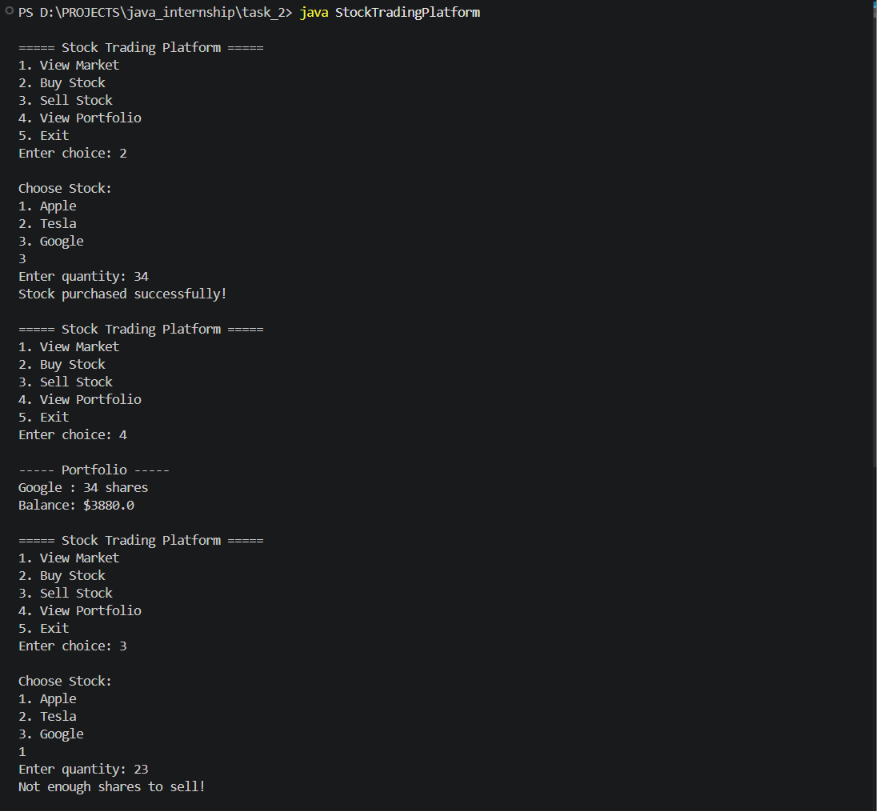

# Stock Trading Platform

A simple Java console-based stock trading simulator.

## Features
- View stock market
- Buy stocks
- Sell stocks
- Portfolio management
- Balance tracking

## Technologies Used
- Java
- Arrays
- HashMap
- Loops
- Scanner Class

## Output Screenshot

